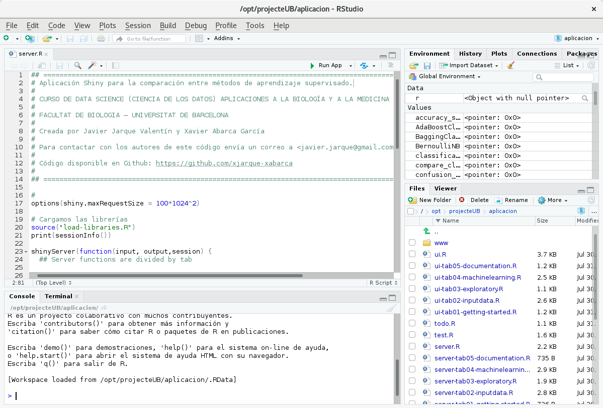
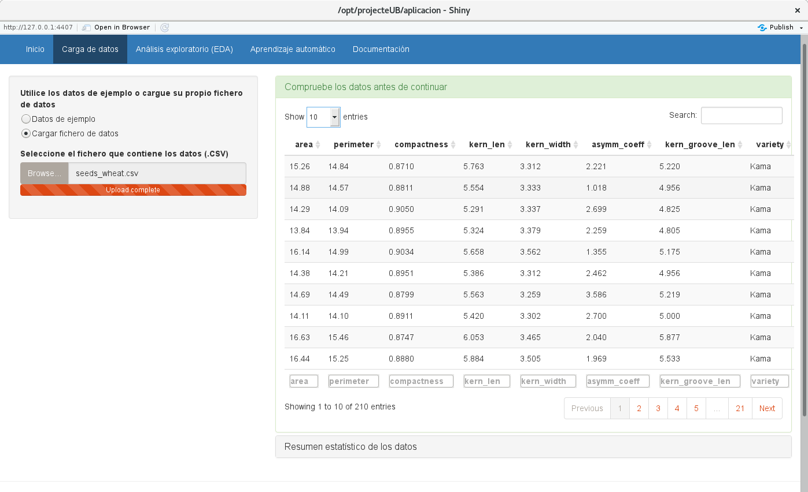

## <a name="documentacion"></a>Documentación

Esta aplicación ha sido desarrollada por Javier Jarque Valentín y Xavier Abarca García como trabajo final del CURSO DE DATA SCIENCE (CIENCIA DE LOS DATOS) APLICACIONES A LA BIOLOGÍA Y A LA MEDICINA CON PYTHON Y R realizado por la FACULTAT DE BIOLOGIA de la  UNIVERSITAT DE BARCELONA.

[Descargar la memoria del proyecto](proyecto_ub_ciencia_de_datos_xjarque_xabarca.pdf)

## <a name="instalacion"></a>Instrucciones de instalación

**Pasos a seguir**


A continuación se muestran los pasos a seguir para instalar esta aplicación. Las instrucciones hacen referencia a la instalación en un sistema operativo de tipo Linux, en concreto en la distribución Lubuntu:

<br>

<br><br>


Descargar *R Studio*. En las imágenes siguientes pueden verse las versiones de R y RStudio utilizadas para la elaboración de este manual:

https://www.rstudio.com/products/rstudio/download/

<br>

<br><br>

<br>

<br><br><br><br>


Descargar el código fuente del proyecto de GitHub:

```
git clone https://github.com/xjarque-xabarca/projecteUB
```


<br>

<br><br>


Cargar el proyecto en RStudio:

<br>

<br><br>


Descargar Python (miniconda) del siguiente enlace:

<a href="https://conda.io/miniconda.html">Descargar miniconda</a>

<br>

<br><br>


Instalar miniconda ejecutando el fichero *Miniconda3-latest-Linux-x86.sh*

<br>

<br><br>


Instalar las librerías de Python necesarias:

```
datascience@dspc:~/miniconda3/bin$ ./conda install pandas scikit-learn matplotlib seaborn
```

<br><br>


Configurar *Reticulate* para poder ejecutar Python. Abrir el fichero *doc/load-python-libraries.R* e indicar la ruta donde está instalado Python en *use_python*  :

<br>

<br><br>


Instalar las librerias de R necesarias para ejecutar el proyecto. Fichero *install.R*:

<br>

<br><br>


Abrir el fichero *ui.R* o *server.R* y ejectuar **Run App**:

<br>

<br><br>


A continuació se abrirá una ventana con la aplicación en ejecución. Seleccione una de al siguientes opciones:

- Inicio | Manual de usuario
- Carga de datos
- Análisis exploratorio (EDA)
- Aprendizaje automático
- Documentación | Manual de instalación

<br>

<br><br>


## <a name="maquina_virtual"></a>Decargar máquina virtual para Oracle Virtual Box

Está disponible un máquina virtual con los fuentes de la aplicación y el software necesario para ejectuarla en la siguiente dirección:

[Descargar la máquina virtual con el proyecto instalado]("drive")

Una vez descargada importela desde *Oracle virtual box*

<br>

<br><br>


Configure la *memoria base* del sistema con **4GB** para su correcto funcionamiento:

<br>


