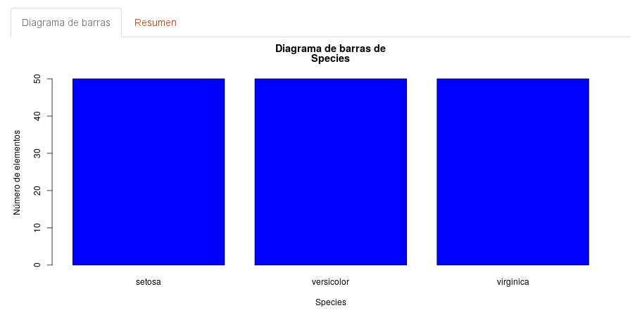

**Descripción:** *Esta aplicación permite aplicar algoritmos de aprendizaje automático a un fichero definido por el usuario.*

## Instrucciones de uso

###  Carga de datos

La primera acción a realizar deberá ser la carga de los datos, para ello ha de seleccionarse la opción de menú correspondiente:

>

Aparecerá un formulario donde se mostrará por defecto un conjunto de datos de ejemplo (Iris dataset). Marcando la opción "Cargar fichero de datos podrá importarse un fichero con datos definidos por el usuario.

El fichero a importar deberá tener el formato que se describe a continuación:

**Formato de los datos**

- Debe ser un fichero .CSV utilizando como separador entre los campos el *punto y coma*.
- La primera fila debe contener los nombres de las variables.
- La última columna debe contener las clases y el resto de columnas las características.

Una vez importado en fichero, se motrarà una tabla con el contenido del mismo. La tabla mostrada tiene la siguientes características:

- Los datos por defecto se muestran paginados. 
- Puede seleccionarse el número de filas por página mediante la opción *Mostrar n entradas *
- Pueden hacerse búsquedas mediante la opción *Buscar*

También es posible obetener un resumen estadístico de los datos (summary), donde pueden observarse diferentes valores estadísticos de las columnas correspondientes a las *características*:

- Valor mínimo
- Primer cuartil
- Mediana
- Media
- Tercer cuartil
- Valor máximo

Además de un recuento de número de elementos de cada una de las *clases*.

 

###  Análisis exploratorio (EDA)

Accediendo a la opción de menú *Análisis exploratorio (EDA)*

incialmente se muestra un diagrama de barras con el número de elementos de cada una de las clases del conjunto de datos:

Mediante el desplegable que se muestra en la parte izquierda de la pantalla, es posible seleccionar también las columnas correspondientes a las características:

y obtener un histograma de frecuencia, donse se puede observar si la distribición se aproxima a la normal.

###  Aprendizaje automático

Accediendo a la opción de menú *Aprendizaje automático*

se muestra un listado de algoritmos de aprendizaje de tipo supervisado, donde puede seleccionarse uno o varios de ellos y aplicarlos al conjunto de datos 
que se ha cargado previamente

Una vez seleccionando los métodos de aprendizaje, se calcularan los resultados y se mostraran en una tabla con 
los valores siguientes:

- Accurancy
- Mean Val. Accuracy
- Std Val. Accuracy
- min, max
- Test set Accuracy

También se pueden visualizar los resultados de forma gráfica, donde se pueden observar los métodos de aprendizaje
ordenados de forma descencente por resultado de su "Accurancy".

### Información de la aplicación

Para obtener información más detallada acceda a la pentaña "Documentación"

